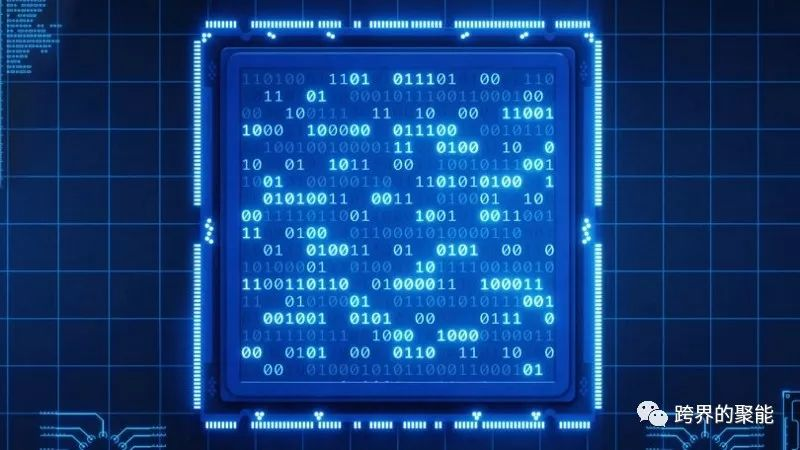
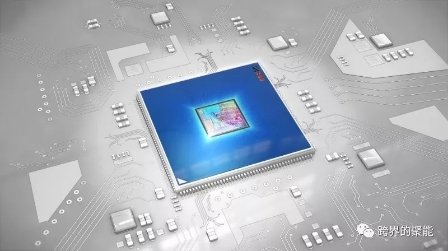
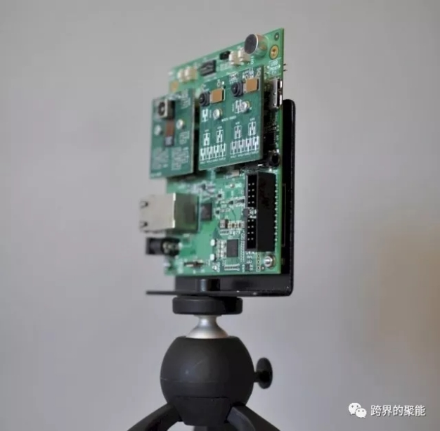

# AI 来到边缘计算（Edge Computing）

> * 原文地址：[AI Comes to Edge Computing](https://medium.com/pcmag-access/ai-comes-to-edge-computing-20ff3ebeb93b)
> * 原文作者：[PCMag](https://medium.com/@pcmagazine)
> * 译文地址：[Awesome-Computer-Programming-Articles-Translation](https://github.com/ThomasTransboundaryYan/Awesome-Computer-Programming-Articles-Translation)
> * 译者：[Transboundaryan](https://github.com/ThomasTransboundaryYan)

强大的本地处理器可以消除设备建立云连接的需要。

在澳大利亚新南威尔士州的海岸线上，一队无人机在空中盘旋，帮助保护水域安全。今年早些时候，无人驾驶飞机帮助该州远北海岸的救生员营救了两名在巨浪中挣扎的青少年。

无人机由人工智能（AI）和机器视觉算法支持，这些算法不断分析视频源，并突出需要注意的部分：比如鲨鱼或游泳者。同样，这种技术可以让 Google 相机对照片进行分类，家庭安全摄像头可以检测陌生人，智能冰箱可以在食物接近有效期时向您发出警告。

但是，尽管这些服务和设备的人工智能功能需要与云的持续连接，但是无论有没有可靠的互联网连接，新南威尔士无人机都可以执行其图像检测任务，这要归功于神经计算芯片可在本地执行深度学习计算。

这些芯片是边缘计算创新不断增长的趋势的一部分，这些创新使我们的软件驱动设备至少能够执行一些关键功能而无需持续连接到云。边缘计算的兴起有助于解决新老问题，为下一代智能设备铺平道路。

## 减轻云的负担

在过去的二十年里，有充分理由证明：云已经成为一种可实现的托管应用程序的方法。

IBM Watson 首席技术官 Rob High 表示：“云之所以如此具有吸引力是因为它往往会降低启动任何您想执行活动的成本。云允许人们不必承担建设基础设施的成本解决现实问题。

随着无处不在的互联网连接和几乎无数的云应用程序、服务和开发平台，创建和部署应用程序的障碍已经大大减少。IBM、Google 和 Amazon 等云服务提供商的大量资源不仅推动了琐碎的业务应用程序的开发，还推动了复杂软件的开发，这些复杂软件需要大量的计算和存储以及人工智能和机器学习算法，还有流媒体和 AR（增强现实）应用程序等。

但是这些进步也带来了一个挑战：我们使用的大多数应用程序只有连接到云端才能运行。这包括在电脑和手机上运行的大多数应用程序，以及冰箱、恒温器、门锁、监控摄像头、汽车、无人机、天气传感器等硬件系统。

随着物联网（IOT）的出现，越来越多的设备正在运行软件并生成数据，其中大多数设备将需要连接到云端来存储和处理这些数据，将这些数据发送到云端所需的功率和带宽是巨大的，存储这些数据所需的空间对于强大的云资源也是一种挑战。

“我们在这些系统中收集了大量的数据，无论是在边缘，还是物联网设备，或任何其他地方，你几乎可以不去关心这些东西了！”High 说。但是，如果每个决策都必须在云中进行，那么所有这些数据都必须通过网络发送到云端服务器以进行清除和过滤。

例如，现代飞机包含数百个传感器用于监控发动机，并在每次飞行期间收集数百 GB 的状态和性能数据。High 认为：“如果你想通过聚合分析它们，那么这些数据中有多少是真正重要的？可能只是其中的一小部分。当你没有必要做任何其他事情时，可以在源头切断而不发送数据。”

以前，在云端之外做一些高难度的工作几乎是不可能的，但是低功耗、低成本的片上系统（SoC）处理器的进步给边缘设备带来了更多的计算能力，让它们承担了生态系统的一些计算，例如执行实时分析或过滤数据。

“边缘环境中有如此多的数据，将一些云计算功能引入到边缘设备中是有意义的，”High 说。

## 隐私问题

边缘计算的好处不仅限于释放云资源。

Movidius (Intel) 新技术和通用团队的经理 RemiElOuazzane 引用商业安全摄像头作为另一个例子，说明边缘计算可以产生巨大影响。你可以在红绿灯、机场和大楼入口处看到这些摄像头，全天候地在网络上录制和传输高质量的视频。

El Ouazzane 说：“你需要将更少的数据带回服务器或数据中心，在本地进行更多的清理和整理，从存储和传输的角度来看，总体成本会更好。”

这意味着摄像机有能力分析其自身输入的视频，确定需要注意哪些帧或视频长度，并仅将该数据发送到服务器。

当这些摄像头安装在您的家中、办公室或任何私人位置时，与云的连接也成为一个潜在的安全问题。黑客和安全研究人员已经能够破坏家用电器以及与他们的云服务器的连接，并拦截敏感的视频源。本地解析数据可以避免在家、私人位置和服务提供商之间建立视频通道。

Movidius 于 2016 年被英特尔收购，专门生产语音识别和计算机视觉等人工智能任务的计算机芯片的几家初创公司之一。该公司生产的视觉处理单元（VPU）——运行神经网络的低功耗处理器可以分析和“理解”数字图像的上下文，而无需将其发送到云端。

Movidius Myriad 2 是一款始终在线的视觉处理器，专为功率受限的环境而设计。

“当相机理解它所看到的语义时，那么对相机能做或不能做的事情施加规则的能力就变得非常容易了。”El Ouazzane 说，“在接下来的 12 个小时里，你不需要真的监控你的起居室，只是为了知道在某个特定的时间，你的狗在穿过沙发前地毯。”

其他公司正在探索使用专门的人工智能边缘计算来保护用户隐私。例如，苹果 iPhoneX 由 A11 仿生芯片提供动力，该芯片可以在本地运行人工智能任务，允许它执行复杂的面部识别，而无需将用户的头像发送到云端。

边缘计算的更多人工智能处理可以为分散式人工智能铺平道路，用户只需要与大型云计算提供商共享更少的数据才能使用人工智能应用程序。

## 减少延迟

大型云提供商的另一个问题是，他们的数据中心位于大城市之外，这些设备将与使用其应用程序的人相隔数百甚至数千英里。

在许多情况下，数据往返云端所造成的延迟会导致性能不佳或更糟的致命结果。这可能是一架无人驾驶飞机试图避免碰撞或降落在不平的地面上，或者是一辆自动驾驶汽车试图决定它是撞上障碍物或行人。

Movidius 对深度神经网络和计算机视觉的轻量级实现使其芯片适合于移动边缘设备，如无人机，对于这些设备，诸如GPU等耗电硬件是不可行的。无人机是一项特别有趣的研究，因为它们需要低延迟的人工智能计算访问，并且必须在离线设置下保持功能。

手势检测是边缘计算有助于改善无人机体验的另一个领域。“我们的目标是让无人机可供许多人使用，手势似乎是人们使用无人机的一种很好的方式。当你示意无人机执行某项任务时，延迟的长短对于你来说很重要，”El Ouazzane 说。

对于像 Skylift Global 这样的初创公司，它为救援人员和急救人员提供重型无人机服务，低延迟接入人工智能和计算资源可以节省金钱和生命。Skylift 的首席执行官兼创始人阿米尔•埃马迪（Amir Emadi）表示：“它将显著降低数据摄取成本，减少网络延迟，提高安全性，并有助于将流式数据转换为实时决策。”

向急救人员提供补给需要瞬间作出决定。“时间越长，例如在扑灭野火时，补救这种情况的成本就越高。我们的无人驾驶飞机即使失去连接也能在边缘做出实时决策，那么我们将能够节省更多的生命、金钱和时间，”Emadi说。

其他需要近实时计算的领域是增强虚拟现实应用和自动驾驶车辆。“这些都是基于经验的计算环境。它们将围绕着人们发生，”纽约一家初创公司 Packet 的首席执行官扎卡里•史密斯（Zachary Smith）表示，该公司专注于使开发人员能够访问高度分布式的硬件。

无法跟上用户动作的 AR 或 VR 应用程序，要么会导致头晕，要么会阻碍身临其境的真实体验。当严重依赖计算机视觉和机器学习算法的自动驾驶汽车成为主流时，延迟将是一个更大的问题。

史密斯说：“30 毫秒的延迟对于加载网页来说并不重要，但对于一辆以 60 英里/小时的速度紧急左转或右转的汽车来说，如果可以避免撞上一个小女孩那就真的很重要了。”

## 迎接边缘的挑战

史密斯承认，尽管有必要使计算更接近边缘，但将专门的硬件放入每一个设备中可能不是最终的答案。“为什么不把所有的电脑都放在车里？我认为这实际上与你控制生命周期的速度的进化有关，”他说。

史密斯说：“当你把硬件放到世界上时，它通常会在那里停留 5 到 10 年，而为这些基于经验的用例提供支持的技术每 6 到 12 个月就会更新一次。”

即使是供应链复杂的大公司也经常难以更新硬件。2015 年，菲亚特克莱斯勒不得不召回 140 万辆汽车来修复五年前暴露的安全漏洞，而芯片制造巨头英特尔仍在努力应对这个设计缺陷，该缺陷将数亿台设备暴露给黑客。

Movidius 的 El-Ouazzane 承认这些挑战，他说：“我们知道，每年我们都要更换一系列产品，因为每年我们都会在边缘带来更多的智能，我们会要求客户升级。”

为了避免不断的召回并让客户长期使用他们的边缘硬件，Movidius 为其处理器配备了额外的资源和容量。“我们需要在未来几年内对这些产品进行升级，”El Ouazzane 说。

史密斯的公司 Packet 使用了一种不同的方法：它创建了可以在城市中部署的微型数据中心，更贴近用户。然后，该公司可以向开发人员提供非常低延迟的计算资源，尽可能接近用户而无需将实际硬件放在边缘。

史密斯说：“我们相信，有必要建立一个基础设施交付机制，将全世界每个城市的开发人员都能访问的硬件安装在一起。”该公司已经在 15 个地点开展业务，并计划最终扩展到数百个城市。

但是，Packet 的雄心壮志远不止是为谷歌（Google）和亚马逊（Amazon）等公司运营的庞大设施创造微型版本。正如史密斯解释的那样，在公共云上部署和更新专用硬件是不可行的。在 Packet 的商业模式中，制造商和开发人员在公司的边缘数据中心部署专门的硬件，在那里他们可以在需要时快速更新和刷新它，同时确保他们的用户能够快速访问计算资源。

Hatch 是 Packet 的客户之一，是 Rovio 的一个分支，Rovio 是一家移动游戏公司，它创造了“愤怒的小鸟”，该公司在边缘计算服务器上运行 Android，为使用低端 Android 设备的用户提供低延迟多人游戏。

史密斯说：“Hatch 在全球市场都使用相当专业的 ARM 服务器。他们对我们的服务器产品进行了定制配置，我们将其投放到欧洲的 8 个国际市场，很快将有 20 或 25 个市场。在他们看来，这就像亚马逊，但他们可以在欧洲的每个市场上运行定制的硬件。”

理论上，Hatch 可以在公共云中做同样的事情，但成本会使其成为一个效率低下的业务。史密斯说：“区别在于每台 CPU 投入 100 个用户而不是每台 CPU 投入 10000 个用户。

史密斯认为，这种模式将吸引能够推动下一代软件创新的开发人员。史密斯说：“我们关注的是如何将在云端的软件与专门的硬件连接起来。我们讨论的是那些甚至无法打开 MacBook 进入内部的用户，而这正是那些将要在硬件/软件中进行创新的用户。”

## 云会消失吗？

随着边缘设备能够执行复杂的计算任务，云的未来是否处于危险之中？

“对我来说，边缘计算是云计算的自然而合乎逻辑的下一步发展，”IBM Watson 的 High 说。

事实上，在 2016 年，IBM 推出了一套工具，允许开发人员在边缘和云之间无缝地分配任务，特别是在物联网生态系统中，边缘设备已经收集了大量关于其即时环境的数据。2016 年底，另一个主要的云开发平台亚马逊网络服务公司（Amazon Web Services）推出了 Greengrass 服务，这项服务使物联网开发商能够在边缘设备上运行部分云应用程序。

这些都不意味着云会消失。“在云中有很多事情做得更好，即使很多工作仍在边缘上进行，”High 说。这包括一些任务，例如聚合来自许多不同来源的数据，并使用大型数据集进行大规模分析。

“如果我们需要在这些边缘设备中使用的人工智能算法中创建模型，那么创建和训练这些模型仍然是一个非常庞大的计算密集型问题，而且通常需要的计算能力远远超过这些边缘设备上的可用能力，”High 说。

El Ouzzane 同意。“在本地训练人工智能模型的能力是极其有限的，”他说。“从深度学习的角度来看，训练只有一个地方可做，那就是在云端。在云端，您可以获得足够的计算资源和足够的存储空间来处理大型数据集。”

El Ouazzane 还提供了一些用例，在这些用例中，边缘设备被分配了任务和时间关键的任务，而云处理的与延迟无关的更高级推断。“我们生活在云与边缘之间的一个连续的世界中。”

“边缘计算和云计算之间存在着非常共生和协同的关系。”High 说。

