# GAN：利用机器学习生成“假”图像

> * 原文地址：[How to recognize fake AI-generated images](https://medium.com/@kcimc/how-to-recognize-fake-ai-generated-images-4d1f6f9a2842)
> * 原文作者：[Kyle McDonald](https://medium.com/@kcimc)
> * 译文地址：[Awesome-Computer-Programming-Articles-Translation](https://github.com/ThomasTransboundaryYan/Awesome-Computer-Programming-Articles-Translation)
> * 译者：[Transboundaryan](https://github.com/ThomasTransboundaryYan)

2014 年，机器学习研究员机器学习研究员伊恩·古德费罗（Ian Goodfellow）提出了生成对抗网络（GANs）的想法。“Generative”是因为 GAN 输出图像而不是对输入图像的预测; “对抗性网络”是因为他们使用两个神经网络相互竞争，就像收银员和伪造者：一个试图欺骗另一个人认为它可以产生真实的例子，另一个试图区分真假。

最初的 GAN 生成的图像很容易被人识别。

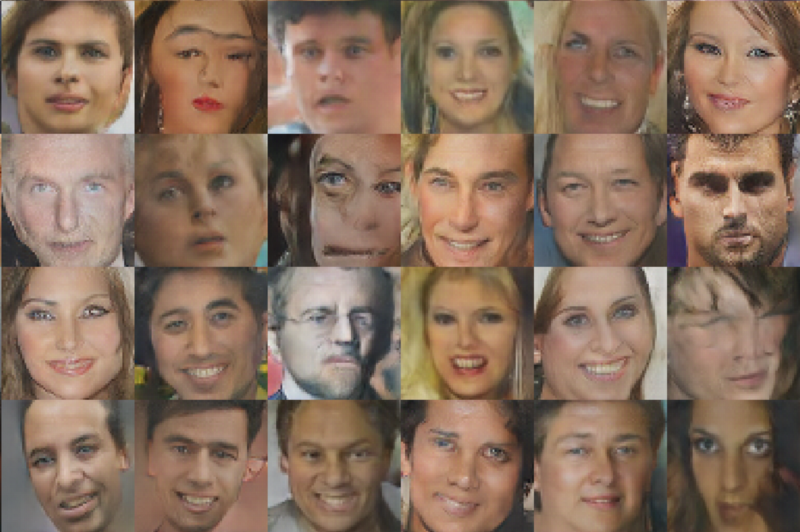

Radford 等人的“无监督表示学习与深度卷积生成性对抗网络”（2014），也称为 DCGAN。

但是，2017 年 10 月发布的 GAN 生成的人脸，越来越难以识别。

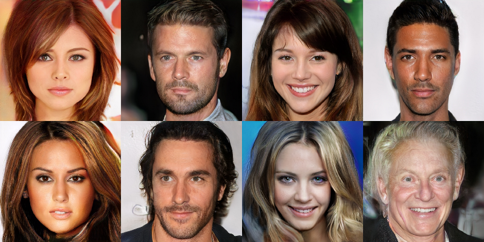

下面是一些您可以在尝试识别由 GAN 生成的图像时寻找的东西。我们将专注于脸部，因为脸部是研究人员其中一个共同的测试对象，而且许多人脸上最明显的人工制品也出现在其他类型的图像中。

### 1. 看起来像油漆的直发

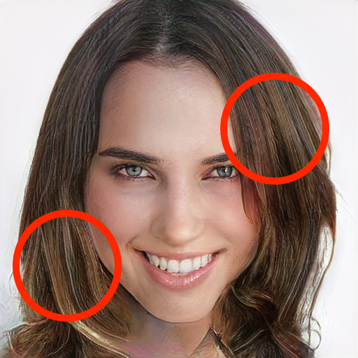

长发通常是这样的：一小片看起来不错，但是长发看起来像是有人用调色刀或大刷子弄脏了一束丙烯酸纤维。

### 2. 难以辨认的文字

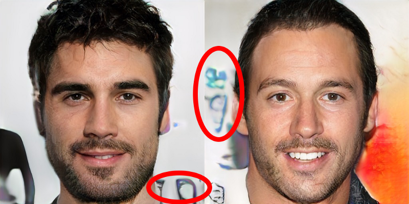

接受过面部训练的 GANs 很难在有很多结构的背景下捕捉到稀有的东西。此外，GAN 还显示了训练数据的原始版本和镜像版本，这意味着它们在编写模型时遇到问题，因为它通常只出现在一个方向上。

### 3. 背景是超现实的

GAN 输出的面孔看起来真实的一个原因是因为所有的训练数据都集中在一起。这意味着，当涉及到例如眼睛和耳朵的生成和显示时，GAN 的可变性较小。另一方面，背景可以包含任何内容。对 GAN 来说，这太多了，无法建模，它最终会复制像纹理这样的一般背景，而不是“真实”的背景场景。

### 4. 不对称性

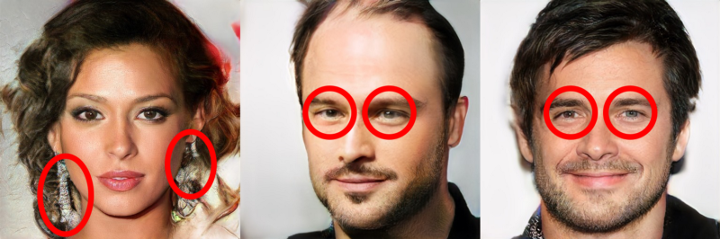

GAN 很难管理图像中较远距离的依赖关系。虽然耳环等成对配件通常在数据集中匹配，但它们不在生成的图像中。或者：眼睛倾向于指向相同的方向并且它们通常是相同的颜色，但是生成的图像中眼睛经常是斜视的并且是异色的。不对称在高度或大小不匹配的耳朵中也很常见。

### 5. 奇怪的牙齿

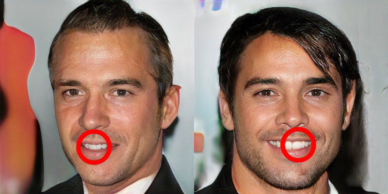

GANs 可以生成一般场景，但目前难以对牙齿等半规则重复细节进行处理。有时 GAN 会生成错位的牙齿，或者会以不寻常的方式拉伸或收缩每颗牙齿。历史上，这个问题也出现在其他领域，比如纹理合成和砖块图像。

### 6. 凌乱的头发

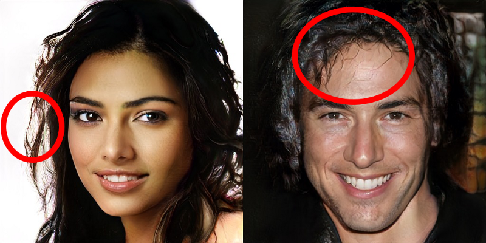

这是分辨 GAN 生成图像的最快方法之一。通常情况下，GAN 会将头发束成团块，在肩膀周围形成随机的小辫子，在额头上甩出厚厚的散乱的毛发。对于 GAN 来说，发型是其中一个最难处理的地方，发型有很多变化，但也有很多细节。不是头发的东西有时也会被处理成像头发一样的纹理。

### 7. 非传统的性别表现

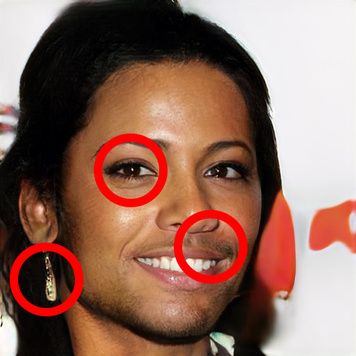

这个 GAN 是在 CelebA 的一个子集上训练的，它包含了 20 万张 10 万个人脸的图片。在这个数据集中，我没有看到一个有面部毛发、耳环和化妆的人的例子，但是 GAN 经常将不同于传统性别描述的属性混合在一起。更加通常的说法，我认为这是因为 GAN 不总是学习人类社会强化的相同类别（在本例中是“男性对女性”）。重要的是要在这里明确：像不对称一样，非传统的性别表达并不是一个内在的指标，一个形象不是“真实的”。与凌乱的头发不同的是，它不是单个图像中的视觉伪像，而是大量图像集合中匹配统计数据时的差异。

### 8. 半规则噪声

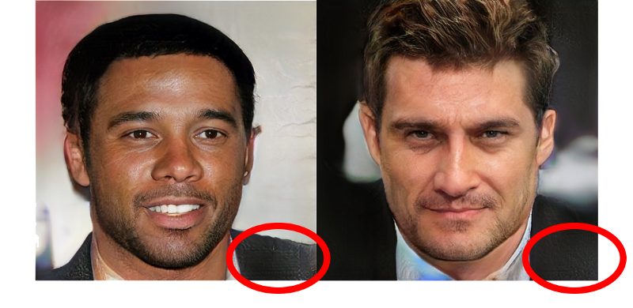

有些单色区域在水平或垂直波段上可能会出现半规则噪声。在上面的例子中，这可能是网络试图模仿布料的纹理。旧的 GAN 有一个更突出的噪声模式，通常被描述为“checkerboard artifacts”。

### 9. 彩虹色

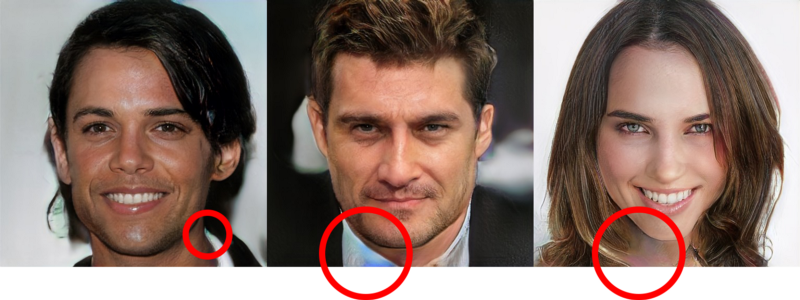

有些浅色纯色的区域有多色调物体，包括领口、领口和眼白（未显示）。

### 10. 真实的图像

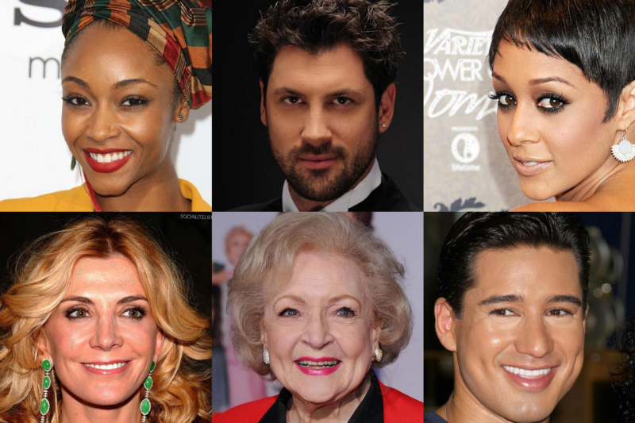

仔细观测背景文字、匹配的耳环、同样大小的牙齿、浓密的头发。考虑到所有这些技巧，试着玩 GAN，测试你区分真假的能力，看看有多少是正确的。

## 一年后

在产生上述图像的“Progressive Growing of GANs”一年后，同样的研究人员出版了“A Style-Based Generator Architecture for GANs”。这项工作改进了上述许多问题。

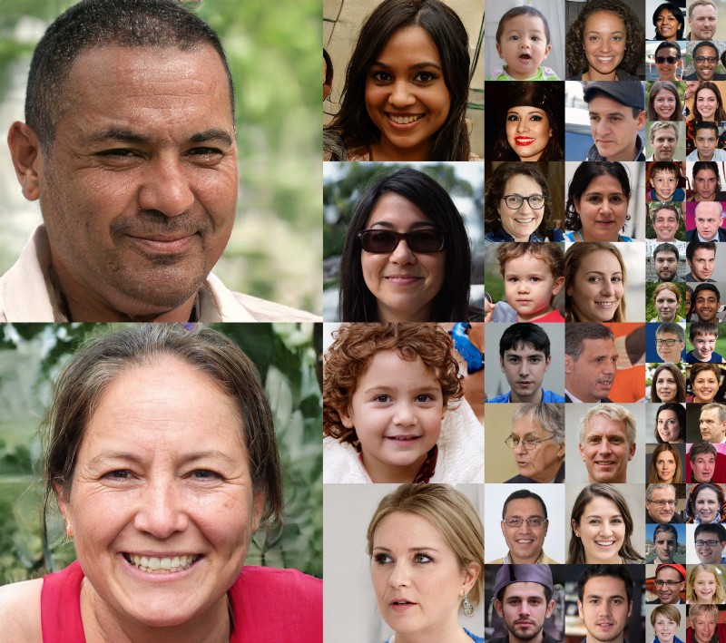

在低分辨率下，几乎所有的图像都无法与照片区分。在我看来，只有少数是最引人注目的。

### 1. 失踪的耳环

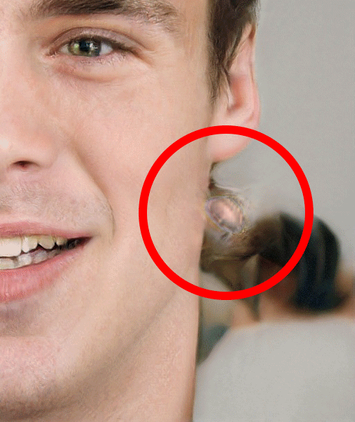

这个错误出现在同一地点的几个图像中。这可能与神经网络试图制造耳环而失败有关，因为它们都来自同一个“源”图像，在一种情况下，当与显示女性面部的“中间风格”混合时，耳环会出现在这个位置。它也可能是无关的，因为另一个例子显示在完全不同的位置的多个图像上出现了类似的错误。

### 2. 不对称

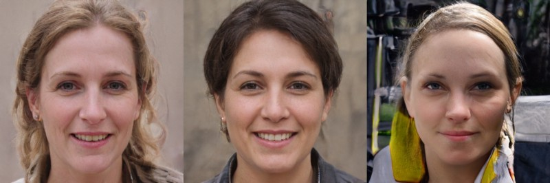

中间是数据集中的“平均人脸”，基于来自世界各地 Flickr 用户的 7 万张照片。右耳（图片左侧）似乎有耳环，但左耳没有。这不是判断一只耳朵上的耳环是“对”还是“错”，而是判断这种不对称在数据集中是否同样常见。右图中不匹配的耳朵大小是不对称的另一个例子。另一个过度频繁不对称的例子可能是这张脸似乎有一些斜视：一只眼睛似乎指向另一只眼睛不同的方向。

### 3. 奇怪的牙齿

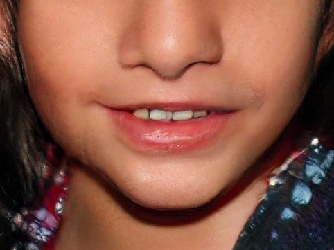

这个问题依旧存在，但你可能得再仔细看一看。在这个例子中，一颗牙齿中间有一个空隙。在其他图像中，它们显示所有牙齿都向一侧滑动。

### 4. 凌乱的头发

也仍然存在，但通常混合在一点更好。

### 5. 绘画渲染

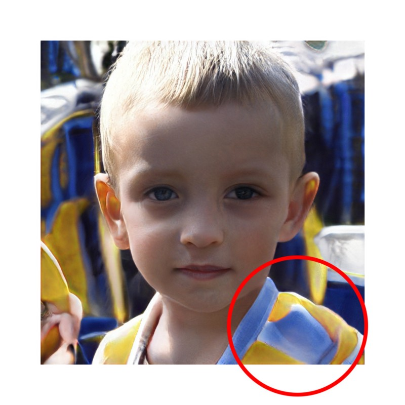

这幅图像有着不同寻常的水彩美学。目前尚不清楚不清楚为什么会出现这种情况。在之前的工作中，他们使用超分辨率网络对训练图像进行预处理。如果他们在这里使用相同的系统。在其他“粗糙风格复制”的图片中，这个区域看起来像是一件色彩鲜艳的衬衫的变体。

✄----------------------------------

如果您发现译文的错误或有更好的表达，欢迎对译文提交 issue 或 PR。

欢迎非商业转载，转载请带上 GitHub 或 公众号原文链接，并在文章开头明显位置注明原文地址、原文作者、译文地址和译者，以表示对作者和译者的感谢。
